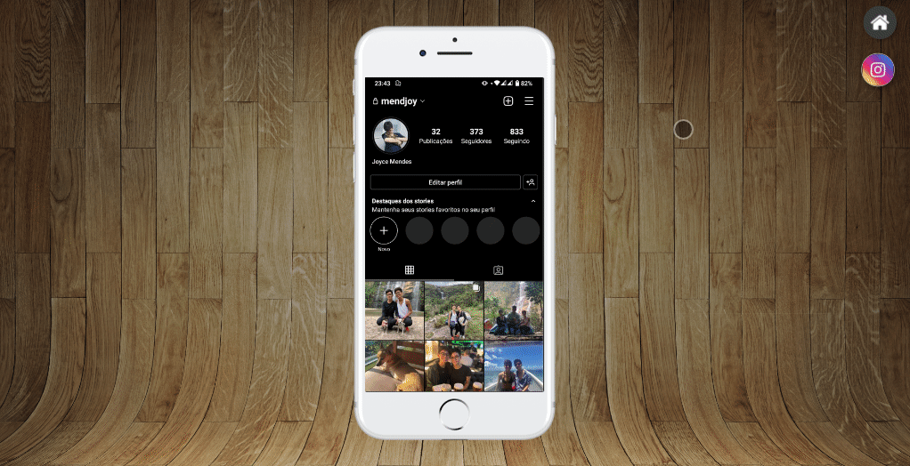

<h1>Projeto Redes Sociais</h1>

Projeto realizado durante o curso de HTML5 e CSS3 do curso em video, neste projeto foi possível aprender e praticar o uso de posições de imagens e a linkar uma página html a outra;

    

   Confira <a href="https://github.com/mendjoy/projeto-redes-sociais/deployments/activity_log?environment=github-pages">aqui</a>

